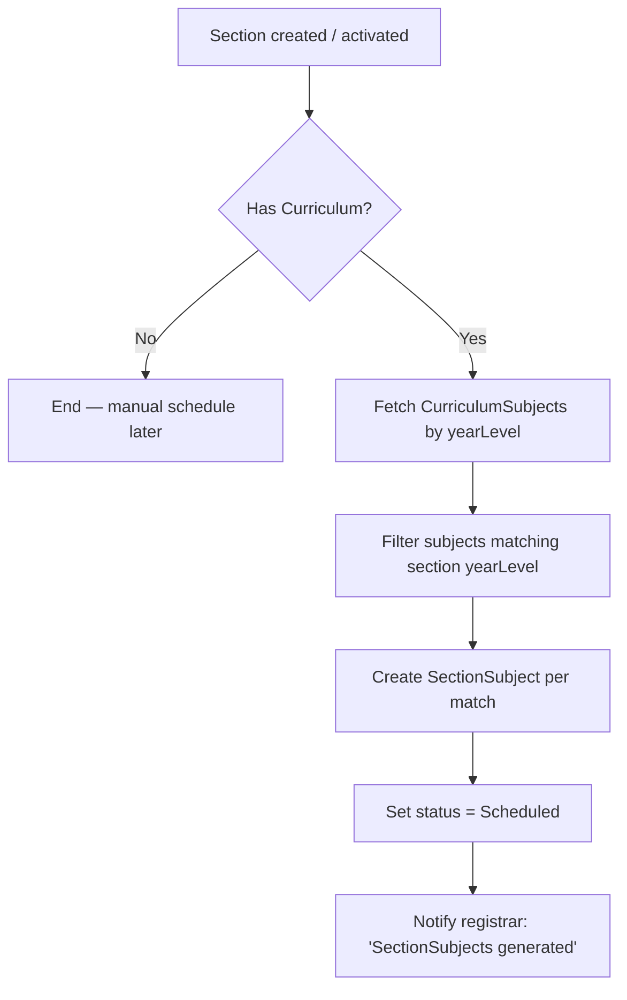

# Curriculum & Curriculum-Subject Automation Plan

## Current State Audit

### Critical Bugs Found

| File | Issue |
|------|-------|
| `server/src/modules/academic/curriculum/services/curriculum.services.js` | `publishCurriculum` is broken. `validateCurriculum` is called without being imported, and the if-block braces are malformed, making the validation and subject-count checks unreachable. |
| `server/src/modules/academic/curriculum/routes/curriculum.subject.routes.js` | Bulk-add route `POST /curriculum/:curriculumId/bulk` calls `getCurriculumSubject` instead of `bulkAddSubjectToCurriculum`. |
| `server/src/modules/academic/curriculum/routes/curriculum.subject.routes.js` | Duplicate GET and POST routes for single-subject operations. |
| `server/src/modules/academic/curriculum/services/curriculum.services.js` | `createNewVersion` copies `prerequisites` from old CurriculumSubject IDs into new CurriculumSubjects, but those IDs change after insertion, breaking the prerequisite graph. |
| `server/src/modules/academic/curriculum/services/curriculum.services.js` | No `clearCache` calls after mutations. |
| `server/src/modules/academic/curriculum/routes/curriculum.routes.js` | No route to import/export curriculum templates. |

### Architectural Flaws & Manual Pain Points

1. **No automatic SectionSubject generation pipeline**  
   The registrar manually clicks "Generate Section Subjects" after creating a section. This should happen automatically when a section is published or created from a curriculum.

2. **No curriculum templates**  
   Every program must manually add every subject. There is no way to clone a curriculum from another program or year.

3. **CurriculumSubject prerequisites are version-fragile**  
   When a curriculum is versioned, `prerequisites` still point to old `CurriculumSubject` IDs, causing broken references.

4. **`displayOrder` is manual**  
   Registrars must manually assign display order numbers. This should auto-increment per year/semester bucket.

5. **`academicYear` field is too rigid**  
   A curriculum usually spans multiple academic years (e.g., 4-year BSIT). Tying it to a single `AcademicYear` forces versioning for use across years.

6. **No curriculum lock**  
   Multiple admins can edit a draft curriculum simultaneously, causing race conditions.

7. **No import/export**  
   Cannot export a curriculum to JSON/CSV for backup or transfer, nor import subjects in bulk from a spreadsheet.

8. **No cache invalidation**  
   `remember()` is used for `getCurriculum` and `getSubject` queries, but mutations never clear the cache.

9. **No validation feedback UI**  
   `validateCurriculum` returns structured errors/warnings, but the frontend has no way to display them before publishing.

10. **Bulk add is transactional-blind**  
    `bulkAddSubjectToCurriculum` uses `insertMany`, but if the 3rd subject of 50 fails a validation, the first 2 are already persisted with no rollback.

## Proposed Automation Architecture

### 1. Fix Critical Backend Bugs (0–2 days)

#### 1.1 Import `validateCurriculum` in `publishCurriculum`
```javascript
// curriculum.services.js
const validateCurriculum = require('../validators/curriculum.validator');

const publishCurriculum = async (id) => {
    const curriculum = await Curriculum.findById(id);
    if (!curriculum) throw new Error('Curriculum not found.');
    if (curriculum.status === 'Published') throw new Error('Curriculum is already published.');
    if (!curriculum.isCurrentVersion) throw new Error("Only the current curriculum version can be published.");

    const validation = await validateCurriculum(id);
    if (!validation.valid) {
        throw new Error({
            message: "Curriculum validation failed.",
            errors: validation.errors,
            warnings: validation.warnings,
        });
    }

    const totalSubjects = await CurriculumSubject.countDocuments({ curriculum: id });
    if (totalSubjects === 0) throw new Error('Cannot publish a curriculum without assigned subjects.');

    curriculum.status = 'Published';
    await curriculum.save();
    return curriculum;
};
```

#### 1.2 Fix `curriculum.subject.routes.js`
```javascript
// Remove duplicate routes
router.get('/curriculum/:curriculumId/subjects', authMiddleware, authorizeRoles('admin', 'registrar'), getCurriculumSubject);
router.post('/curriculum/:curriculumId/subjects', authMiddleware, authorizeRoles('admin', 'registrar'), addSubjectToCurriculum);
router.post('/curriculum/:curriculumId/bulk', authMiddleware, authorizeRoles('admin'), bulkAddSubjectToCurriculum); // was getCurriculumSubject
router.put('/curriculumsubject/:id', authMiddleware, authorizeRoles('admin'), updateCurriculumSubject);
router.delete('/curriculumsubject/:id', authMiddleware, authorizeRoles('admin'), removeCurriculumSubject);
```

#### 1.3 Fix `createNewVersion` prerequisite mapping
```javascript
// After inserting new CurriculumSubjects, rebuild prerequisite IDs
const oldIdToNewId = new Map();
for (const old of curriculumSubjects) {
    const created = await CurriculumSubject.create({ /* ... */ });
    oldIdToNewId.set(String(old._id), String(created._id));
    newSubjects.push(created);
}

for (const newSubj of newSubjects) {
    const oldSubj = curriculumSubjects.find(o => String(o.subject) === String(newSubj.subject));
    if (oldSubj && oldSubj.prerequisites?.length) {
        newSubj.prerequisites = oldSubj.prerequisites
            .map(oldPrereqId => oldIdToNewId.get(String(oldPrereqId)))
            .filter(Boolean);
        await newSubj.save();
    }
}
```

### 2. Automatic SectionSubject Generation Pipeline (3–5 days)

When a `Section` is created or status changes to `Active`, automatically generate `SectionSubject` records from the linked `Curriculum`’s `CurriculumSubject`s.



**Files to create/modify:**

| File | Action |
|------|--------|
| `server/src/modules/sectionsubject/services/generate-section-subjects.js` | New file: `generateSectionSubjects(sectionId)` |
| `server/src/modules/academic/section/services/section.services.js` | Hook into `createSection` or `updateSection` when `curriculum` is assigned |
| `server/src/modules/academic/section/controller/section.controller.js` | Call generator after successful section creation |

**Service logic:**
```javascript
const generateSectionSubjects = async (sectionId) => {
    const section = await Section.findById(sectionId).populate('curriculum');
    if (!section?.curriculum) return [];

    const curriculumSubjects = await CurriculumSubject.find({
        curriculum: section.curriculum._id,
        yearLevel: section.yearLevel,
    }).populate('subject');

    const docs = curriculumSubjects.map(cs => ({
        section: section._id,
        subject: cs.subject._id,
        semester: cs.semester,
        status: 'Scheduled',
        createdBy: section.createdBy,
    }));

    return await SectionSubject.insertMany(docs);
};
```

### 3. Curriculum Templates Engine (2–3 days)

Allow admins to create a curriculum from an existing template or from another curriculum.

**New endpoints:**

| Method | Path | Purpose |
|--------|------|---------|
| `POST` | `/curriculum/:id/template` | Save curriculum as reusable template |
| `POST` | `/curriculum/from-template` | Create new curriculum from template |
| `GET` | `/curriculum/templates` | List saved templates |
| `POST` | `/curriculum/:id/export` | Export curriculum to JSON |
| `POST` | `/curriculum/import` | Import curriculum from JSON payload |

**Template model (new):**
```javascript
{
    name: String,
    program: ObjectId ref Program,
    totalYears: Number,
    subjects: [{
        subjectCode: String,
        subjectName: String,
        yearLevel: Number,
        semester: Number,
        units: Number,
        prerequisites: [String] // subjectCode strings, resolved on import
    }],
    createdBy: ObjectId ref User
}
```

### 4. Auto Display Order & Semester Bucketing (1 day)

When `addSubjectToCurriculum` or `bulkAddSubjectToCurriculum` is called, auto-assign `displayOrder` if not provided.

```javascript
const AUTO_ORDER = async (curriculumId, yearLevel, semester) => {
    const maxOrder = await CurriculumSubject
        .find({ curriculum: curriculumId, yearLevel, semester })
        .sort({ displayOrder: -1 })
        .limit(1)
        .select('displayOrder');

    return (maxOrder[0]?.displayOrder || 0) + 1;
};
```

Apply in both `addSubjectToCurriculum` and `bulkAddSubjectToCurriculum`.

### 5. Curriculum Lock / Checkout (1 day)

Prevent concurrent editing of Draft curriculums.

**Schema addition:**
```javascript
lock: {
    lockedBy: { type: mongoose.Schema.Types.ObjectId, ref: 'User', default: null },
    lockedAt: { type: Date, default: null }
}
```

**Middleware:** reject mutations if `lock.lockedBy` exists and is not the current user.

**Auto-release:** lock expires after 4 hours (`lockedAt + 4h`).

### 6. Cache Invalidation Layer (1 day)

```javascript
// curriculum.services.js
const { clearCache } = require('../../../utils/cache.helper');

// After every mutation:
await clearCache('curriculums', `curriculum:${id}`, `curriculumSubjects:${id}`);
```

Apply to:
- `createCurriculum`
- `updateCurriculum`
- `publishCurriculum`
- `archiveCurriculum`
- `createNewVersion`
- `addSubjectToCurriculum`
- `bulkAddSubjectToCurriculum`
- `updateCurriculumSubject`
- `removeCurriculumSubject`

### 7. Curriculum Import/Export + Bulk Validation (2 days)

- Export curriculum + subjects as a single JSON file.
- Import with `insertMany` wrapped in a transaction.
- Validate all prerequisites, duplicates, and inactive subjects BEFORE inserting.
- Return batch-level errors so the UI can show a summary.

### 8. Frontend Changes Required

| Component | Change |
|-----------|--------|
| `CurriculumModal.jsx` | Add “Import from Template” dropdown + “Export JSON” button |
| `Curriculum.jsx` | Show validation warnings before allowing publish; show lock status |
| `CurriculumToolbar.jsx` | Add auto-generate section subjects button per curriculum |
| Subject table | Enable drag-and-drop reordering for `displayOrder` |

## Implementation Priority

| Phase | Task | Effort | Impact |
|-------|------|--------|--------|
| **P0** | Fix broken `publishCurriculum` | 0.5d | Critical — publishing is non-functional |
| **P0** | Fix duplicate/wrong routes | 0.5d | Critical — bulk add is broken |
| **P0** | Fix version prerequisite mapping | 0.5d | High — versioning corrupts data |
| **P1** | Auto SectionSubject generation | 3d | High — eliminates biggest manual step |
| **P1** | Auto `displayOrder` assignment | 1d | High — removes manual numbering |
| **P1** | Cache invalidation | 1d | Medium — stale data bug |
| **P2** | Curriculum templates | 2d | Medium — speeds up creation |
| **P2** | Curriculum lock/checkout | 1d | Medium — prevents conflicts |
| **P2** | Import/export | 2d | Medium — data portability |
| **P3** | Frontend validation feedback | 1d | Low — UX improvement |

## Backend API Contract Changes

### New Routes

```
POST   /curriculum/:id/template
POST   /curriculum/from-template
GET    /curriculum/templates
POST   /curriculum/:id/export
POST   /curriculum/import
POST   /section/:id/generate-subjects
```

### Modified Request/Response

**`POST /curriculum`** now returns:
```json
{
    "curriculum": { ... },
    "generatedSectionSubjects": 18,
    "message": "Curriculum created. 18 SectionSubjects were auto-generated for matching sections."
}
```

**`GET /curriculum/:id`** now returns:
```json
{
    ...curriculum,
    "lock": { "lockedBy": null, "lockedAt": null },
    "validation": { "valid": true, "errors": [], "warnings": ["Subject X uses outdated version"] }
}
```

## Risks

| Risk | Mitigation |
|------|-----------|
| Auto-generation creates unwanted SectionSubjects | Only generate for `Active` sections; abort if `SectionSubject` records already exist for that section+curriculum+yearLevel |
| Template prerequisites ambiguous across programs | Require explicit `subjectCode` matching; warn on missing subjects during import |
| Lock timeout causes deadlock | Auto-expire lock after 4h; admin force-unlock endpoint |
| Bulk import N+1 performance | Use `insertMany` + parallel validation queries |
