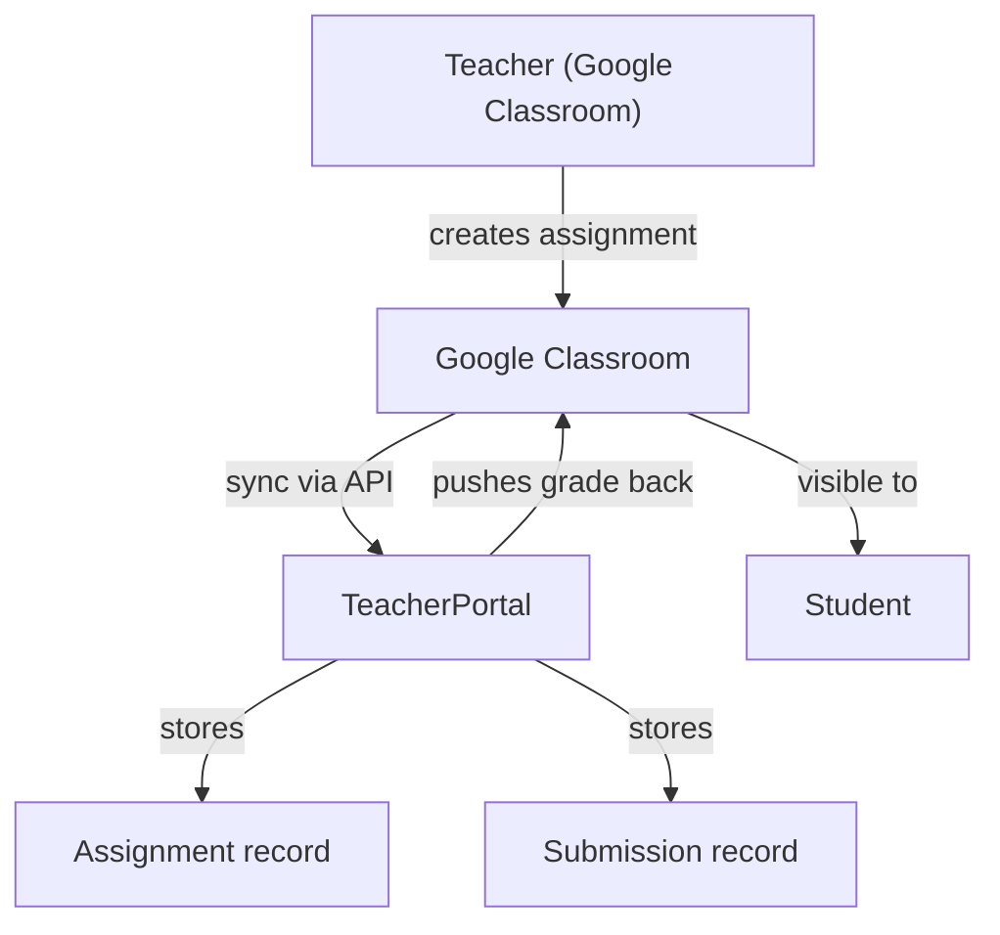
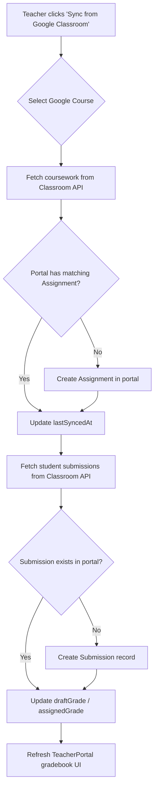

# Google Classroom Integration Plan

## Objective

Reduce manual data entry for teachers by synchronizing Google Classroom coursework, submissions, and grades with the TeacherPortal gradebook.

## Current State

- Teachers manually encode grades in the portal.
- No native assignment/submission model exists yet.
- A navigation link to `/grade` exists, but the page/module has not been implemented.
- The `StudentSubject` schema already stores `finalGrade` and `remarks`.

## Google Classroom API Capabilities Used

| Feature | API Method | Direction |
|---|---|---|
| List courses | `courses.list` | Read |
| List students | `courses.students.list` | Read |
| List coursework | `courses.courseWork.list` | Read |
| Get submission | `courses.courseWork.studentSubmissions.list` | Read |
| Update grade | `courses.courseWork.studentSubmissions.patch` | Write |
| Create coursework | `courses.courseWork.create` | Write |
| List topics | `courses.topics.list` | Read |

Contact: `developers.google.com/workspace/classroom`

## Recommended Architecture

### New Data Model

Add a minimal sync layer inside the existing `server/src/modules/` structure. Do not create a separate `googleclassroom` module yet; instead, extend the existing grade/academic load flow.

#### `Assignment` (new model)

| Field | Type | Notes |
|---|---|---|
| `title` | String | Assignment name |
| `description` | String | Instructions |
| `maxPoints` | Number | e.g. 100 |
| `dueDate` | Date | Optional |
| `sectionSubject` | ObjectId → SectionSubject | Links to portal class |
| `googleCourseWorkId` | String | Google Classroom coursework ID |
| `googleCourseId` | String | Google Classroom course ID |
| `lastSyncedAt` | Date | When grades were last pulled |

#### `Submission` (new model)

| Field | Type | Notes |
|---|---|---|
| `assignment` | ObjectId → Assignment | |
| `student` | ObjectId → Student | |
| `submissionState` | String | NEW, TURNED_IN, RETURNED |
| `draftGrade` | Number | Teacher’s draft grade |
| `assignedGrade` | Number | Final returned grade |
| `googleStudentSubmissionId` | String | Google submission ID |
| `syncedAt` | Date | Last sync timestamp |

## Grade Sync Flow

## Implementation Phases

### Phase 1 — Backend Sync Service

- Create `server/src/modules/grades/services/google-classroom.service.js`
- Implement a `syncSectionSubjectGrades(sectionSubjectId, teacherGoogleAccessToken)` function.
- Map Google `courseId` → `SectionSubject.instructor` and Google `courseWorkId` → `Assignment.googleCourseWorkId`.
- Use `googleapis` npm package (already widely used in Node).
- Store OAuth tokens in `User.googleAccessToken` and `User.googleRefreshToken` (encrypted/secure).

Server files touched:
- `server/src/modules/grades/models/assignment.model.js`
- `server/src/modules/grades/models/submission.model.js`
- `server/src/modules/grades/services/google-classroom.service.js`
- `server/src/modules/grades/controllers/grade.controller.js`
- `server/src/modules/grades/routes/grade.routes.js`

### Phase 2 — Frontend Gradebook (Teacher)

- Build `client/src/modules/grades/pages/Grades.jsx`
- Layout:
  - Left: Sections taught by logged-in teacher.
  - Center: Assignments for selected section.
  - Right: Student grade table (editable or read-only).
- Add “Sync from Google Classroom” button per section.
- Use `react-toastify` for sync status messages.

### Phase 3 — Auto-Sync (Optional)

- Add a cron job or server-side scheduler that runs every few hours.
- Only sync sections where `lastSyncedAt` is older than X hours.
- Reduces the need for teachers to click sync manually.

### Phase 4 — Grade Passback

- When a teacher edits a grade in TeacherPortal, optionally push the change back to Google Classroom.
- Use `studentSubmissions.patch` with `updateMask=assignedGrade`.
- Respect Google’s finality rules (returned submissions require `return` before further edits).

## Authentication & Security

- Each teacher must authorize the app once using Google OAuth 2.0.
- Required scopes:
  - `https://www.googleapis.com/auth/classroom.courses`
  - `https://www.googleapis.com/auth/classroom.coursework.students`
  - `https://www.googleapis.com/auth/classroom.rosters`
  - `https://www.googleapis.com/auth/classroom.student-submissions.students`
- Tokens stored server-side only; never exposed to the client.
- Refresh tokens handled automatically by the backend service.

## Benefits

- Teachers create assignments once in Google Classroom.
- Portal auto-imports grades without re-typing.
- Single source of truth for both LMS and SIS.
- Students see consistent grades in both systems.

## Risks & Mitigations

| Risk | Mitigation |
|---|---|
| Google quota limits | Batch requests, cache aggressively |
| Duplicate assignments | Match on `googleCourseWorkId` before creating |
| Stale grades | Manual “Sync” button + optional auto-sync |
| Token expiry | Auto-refresh using `googleRefreshToken` |

## Future Enhancements

- Attendance sync using Google Meet participation data.
- Announcement sync from Classroom to portal notifications.
- Rubric-grade breakdown sync (supported by Classroom API since 2024).
