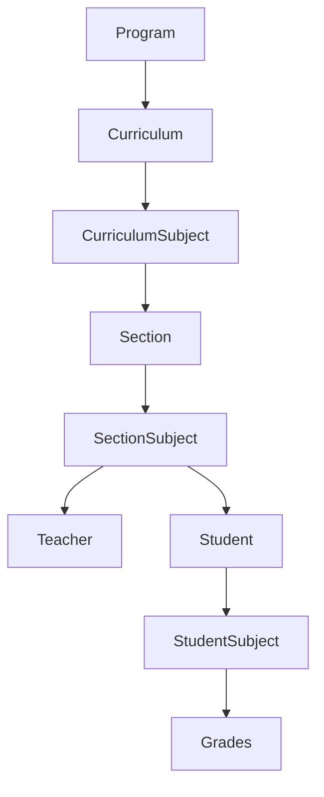
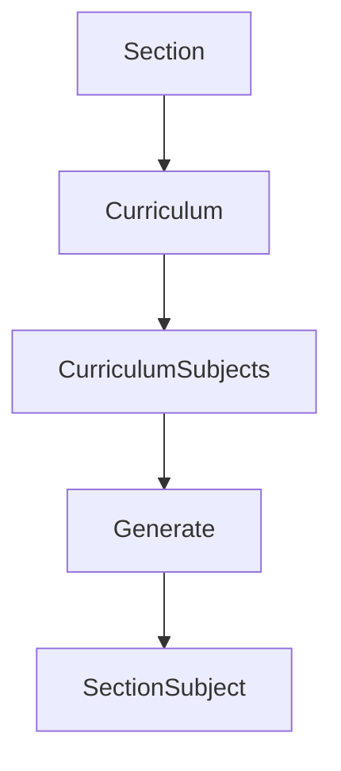

# Academic Subject Generation Architecture

## Overview

The School Management System follows a multi-stage academic workflow to transform a curriculum into actual classes and finally into each student's academic load.

Rather than assigning curriculum subjects directly to students, the system first creates **Section Subjects**, allowing each section to have its own instructor, schedule, and room before students receive their subjects.

## Architecture



## Stage 1 – Program

Programs represent the degree offered by the institution.

Examples:

- BSIT
- BSCS
- BSEd
- BSBA

Each program contains one or more curriculum.

## Stage 2 – Curriculum

A curriculum defines all subjects required for a specific program.

Example:

BSIT Curriculum 2024

A curriculum contains:

- Program
- Academic structure
- Curriculum Subjects

## Stage 3 – Curriculum Subjects

Curriculum Subjects define what students should study.

Example:

| Year | Semester | Subject |
|-------|-----------|----------|
| 1 | 1 | Programming 1 |
| 1 | 1 | Introduction to Computing |
| 1 | 1 | Mathematics |
| 1 | 1 | NSTP |
| 1 | 1 | PE |

At this stage there are:

- No sections
- No instructors
- No schedules
- No students

These are simply the academic requirements.

## Stage 4 – Section Creation

The registrar creates a section.

Example:

BSIT-1A

A section contains:

- Curriculum
- Academic Year
- Year Level
- Capacity
- Adviser

Example:

```
Section
BSIT-1A

Curriculum:
BSIT Curriculum 2024

Year Level:
1

Academic Year:
2026–2027
```

At this point, the section still has no scheduled classes.

## Stage 5 – Generate Section Subjects

This is the first stage where actual classes are created.



For every Curriculum Subject matching the section's:

- Curriculum
- Year Level

a Section Subject is created.

Example:

```
SectionSubject

Section:
BSIT-1A

Subject:
Programming 1

Instructor:
None

Room:
None

Schedule:
None

Another record:

SectionSubject

Section:
BSIT-1A

Subject:
Introduction to Computing

Another:

SectionSubject

Section:
BSIT-1A

Subject:
PE
```

Each record represents an actual class that will eventually be taught.

## Stage 6 – Configure Section Subjects

The registrar assigns:

- Instructor
- Room
- Day
- Start Time
- End Time

Example:

```
Programming 1

Instructor:
Juan Dela Cruz

Room:
Lab 2

Day:
Monday

Time:
08:00 AM – 10:00 AM
```

After configuration, the class schedule is considered ready.

## Stage 7 – Student Approval

Admissions and Registrar approve an applicant.

```
Application
      │
      ▼
    Approved
      │
      ▼
      User
      │
      ▼
    Student
```

The student now belongs to:

- Program
- Section
- Academic Year

The student still has no academic load.

## Stage 8 – Generate Student Subjects

Once the student belongs to a section, the student's academic load is generated.

```
Student
      │
      ▼
    Section
      │
      ▼
SectionSubject
      │
      ▼
StudentSubject
```

Each Student Subject references one Section Subject.

Example:

```
Student

↓

Programming 1

↓

SectionSubject

↓

Status

↓

Grade
```

This design ensures the student automatically inherits:

- Instructor
- Room
- Schedule

through the Section Subject.

## Why Student Subjects are Generated from Section Subjects

Instead of reading directly from Curriculum Subjects:

```
Student
      │
      ▼
CurriculumSubject
      │
      ▼
StudentSubject
```

the system uses:

```
Student
      │
      ▼
    Section
      │
      ▼
SectionSubject
      │
      ▼
StudentSubject
```

This approach provides several advantages.

### Centralized Schedule

The schedule is stored only once.

Changing a class schedule automatically affects every enrolled student.

### Centralized Instructor

Changing the instructor only updates one Section Subject.

Every enrolled student immediately sees the new instructor.

### Centralized Room Assignment

Changing rooms requires updating only one record.

Students automatically receive the updated classroom.

### Easier Faculty Portal

Teachers retrieve all assigned classes directly from Section Subjects.

```
Teacher

↓

SectionSubject
```

### Easier Student Portal

Students retrieve their schedules through Student Subjects.

```
Student

↓

StudentSubject

↓

SectionSubject
```

### Easier Grade Encoding

Teachers encode grades using:

```
Teacher

↓

SectionSubject

↓

StudentSubject

↓

Grade
```

No additional relationships are required.

## Current Academic Workflow

```
Registrar

↓

Program

↓

Curriculum

↓

CurriculumSubject

↓

Section

↓

Generate Section Subjects

↓

Assign Instructor

↓

Assign Schedule

↓

Approve Student

↓

Generate Student Subjects

↓

StudentSubject

↓

Grade Encoding

↓

Student Grades
```

## Benefits of this Architecture

- Separation of curriculum and actual class offerings.
- A section owns its own schedule.
- A section owns its assigned instructors.
- Students inherit schedules from their section.
- Faculty teaching loads are generated automatically.
- Student schedules require no duplicated scheduling data.
- Grade encoding naturally integrates with scheduled classes.
- Future attendance, timetable, and reporting modules can reuse the same Section Subject records.

## Future Enhancements

The current implementation stores one meeting schedule per Section Subject.

Future versions may introduce a dedicated `ScheduleSlot` model to support:

- Multiple meeting days per subject
- Laboratory schedules
- Weekend classes
- Holiday adjustments
- Conflict detection
- Timetable generation

This enhancement can be implemented without changing the overall academic workflow because `SectionSubject` will remain the central representation of an offered class.
